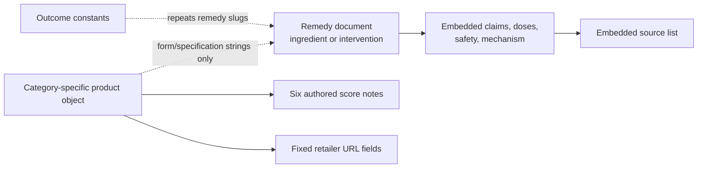
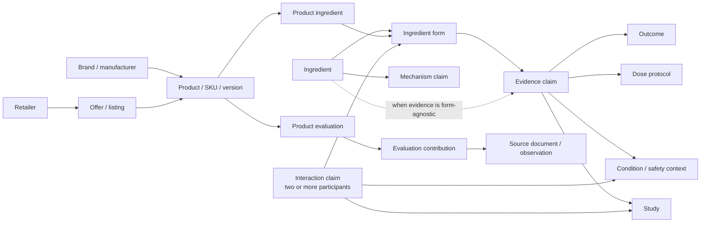

# Somnary information architecture decision audit

**Status:** read-only analysis of the current implementation  
**Evidence base:** the existing repository and `docs/audits/01-recon.md`  
**Scope:** information architecture, content modelling, navigation, URLs, progressive disclosure, and the decisions raised by L01, L03, CT01, CT02, CT04, CT05, and CT06  
**Not in scope:** visual redesign, copy production, legal advice, or implementation

## Executive view

Somnary currently has two different information architectures sharing one shell:

1. a relatively mature **remedy evidence system**, where a visitor can move from an aggregate grade to claims, dosing, safety, and numbered sources; and
2. a much less connected **product scorecard system**, where products live in five ingredient-specific datasets, are absent from global search, and receive public grades without a publishable contribution trail for each scored dimension.

That split is now the main structural constraint. Product scorecards account for **88 of 166 live routes**, or just over half the site, but product and brand discovery is not part of the global search model (`docs/audits/01-recon.md:17-27`; `src/lib/search.ts:22-44`). The top navigation says “Which to buy,” while the methodology says a ranking is a recommendation and Somnary does not rank products (`src/components/Nav.astro:9-17`; `src/pages/sources/methodology.astro:94-96`). The site therefore makes product evaluation dominant by route count, secondary by navigation and search, and unresolved in editorial stance.

The most important IA move is not a new menu. It is to decide what Somnary’s named objects are and how evidence may flow between them:

- an ingredient is not the same object as a compound form;
- neither is the same object as a branded product or SKU;
- a retailer listing is time-sensitive information about a product, not an attribute of the evidence;
- a product does not inherit “efficacy” merely because its label names the same ingredient;
- a displayed grade needs an explicit publication and uncertainty state;
- a scored dimension is not traceable merely because it has a name and a note.

The code already contains good foundations worth protecting:

- remedy claims have local citation references that must resolve to a source (`src/content.config.ts:40-82`, `src/content.config.ts:162-179`);
- remedy pages have a useful quick decision layer followed by claims, dosing, safety, mechanism, and full sources (`src/pages/r/[slug].astro:60-186`);
- claim rows expose study counts and citations (`src/components/ClaimsDataTable.astro:24-59`);
- dosing and safety are presented as decision-relevant content rather than generic education (`src/components/DosingGrid.astro:17-39`; `src/components/SafetyCallout.astro:30-81`);
- outcome pages connect a goal to candidate remedies and their grades (`src/pages/outcome/[slug].astro:39-78`);
- the crawl has no broken internal links, the responsive shell did not overflow, and the evidence/community distinction is already visible (`docs/audits/01-recon.md:166-179`).

The recommendations below preserve those strengths while making the underlying entities and public promises explicit.

## 1. Intent model

### Validation rule

Every intent below is a **DESIGN ASSUMPTION — unvalidated**. Repository structure can show what the site supports, but it cannot show demand, frequency, or visitor priority. No persona has been invented. Before treating the order as a roadmap, validate it with four kinds of evidence:

- anonymised on-site search logs, including zero-result and reformulation patterns;
- support enquiries, corrections, and product-submission themes;
- a five-person task-based usability round on mobile, recruited by relevant task rather than demographic persona;
- retailer/referral analytics, where available, for product-detail and outbound-listing behaviour.

Search and support data should be interpreted as task signals, not as proof that the existing vocabulary is correct. The usability round should ask participants to bring or choose a real decision; it should not teach Somnary’s labels first.

### A. Orient from a sleep goal or problem

**DESIGN ASSUMPTION — unvalidated**

- **Intent:** “I have a sleep problem; what kinds of options should I investigate?”
- **Likely entry point:** a search engine result, the homepage, or `/start-here`, not a known remedy URL.
- **A good answer:** a bounded set of relevant outcomes or intervention categories, the strength and limits of the evidence, and a safe next step. It should distinguish a route for self-education from a route for clinical care.
- **Expected time to useful answer:** 30–90 seconds for orientation; longer only if the visitor chooses to compare options.
- **Leave triggers:** the page begins with brand or internal taxonomy; the outcome language does not match the visitor’s words; the site implies diagnosis; the visitor cannot see what to do next.
- **Current routes:** `/`, `/start-here`, `/outcome/[slug]`, `/tiers`, and global search. The homepage and start page both expose situation-led choices (`src/pages/index.astro:10-18`, `src/pages/index.astro:71-120`; `src/pages/start-here.astro:31-75`). Outcome pages then rank linked remedies by grade (`src/pages/outcome/[slug].astro:39-78`).
- **Validation path:** cluster symptom and goal phrases in search logs; review support enquiries for “where do I start?” patterns; run a five-person first-click test from the homepage using participants’ own sleep goals; use retailer analytics only as a downstream check on whether orientation leads prematurely to shopping.

The current implementation supports this intent better than the global navigation suggests. It should remain a first-class path, but its status as the most common path is an inference, not an observed fact.

### B. Check a safety concern or interaction

**DESIGN ASSUMPTION — unvalidated**

- **Intent:** “Can I take this with my medicine, condition, pregnancy status, or another sleep aid?”
- **Likely entry point:** search for “X with Y,” a remedy safety section, the label checker, or a direct answer from a search engine.
- **A good answer:** the identified substances and forms, what is known, the direction and severity of any interaction, confidence and source recency, the relevant dose or population context, and a clear pharmacist/clinician handoff where the model cannot answer safely.
- **Expected time to useful answer:** under 60 seconds for triage; source review may take several minutes.
- **Leave triggers:** “no flags” is presented as “safe”; two-way relationships are expressed as undifferentiated strings; the answer cannot distinguish lack of evidence from evidence of no interaction; critical risk is below non-critical detail.
- **Current routes:** `/r/[slug]` safety sections, `/label-checker`, and global search. Remedy safety stores an overall severity plus free-text interactions and pooled sources (`src/content.config.ts:105-113`); the page renders those strings with citations (`src/components/SafetyCallout.astro:58-75`). The checker applies string and threshold rules, including an interaction rule (`src/lib/label-rules.ts:220-245`).
- **Validation path:** analyse search terms shaped like “X + Y,” “with,” and medicine names; code support enquiries for interactions and contraindications; run a five-person timed safety task and score whether each person reaches the correct safe handoff; inspect retailer analytics for journeys that go from a risk page directly to purchase, which may indicate over-reassurance.

The current model can warn about a known single-product interaction, but it cannot safely answer combination questions as a graph of two or more substances.

### C. Understand whether and how a remedy works

**DESIGN ASSUMPTION — unvalidated**

- **Intent:** “Does this work, for whom, by how much, and why?”
- **Likely entry point:** a remedy result in search, an outcome page, a shared remedy URL, or a source citation.
- **A good answer:** an aggregate decision summary, outcome-specific claims, studied population, effect size or absence of one, evidence gates, plausible mechanism clearly separated from clinical outcome evidence, dose/form used, uncertainty, and traceable studies.
- **Expected time to useful answer:** 20–45 seconds for the verdict; 3–10 minutes for careful evidence review.
- **Leave triggers:** an unexplained letter grade; mechanism is used as proof of outcome; a study count substitutes for magnitude or applicability; a provisional grade looks final; citations cannot be connected to individual claims.
- **Current routes:** `/r/[slug]`, `/tiers`, `/outcome/[slug]`, and `/search`. The remedy page already layers a decision lead, claim table, dose, safety, mechanism, and full source list (`src/pages/r/[slug].astro:60-186`; `src/components/RemedyLeadBlock.astro:39-76`; `src/components/SourcesList.astro:16-33`).
- **Validation path:** measure search demand for “does,” “work,” “evidence,” and “how”; review citation clicks and movement from the lead block into claims; code support questions about efficacy versus mechanism; use five-person comprehension tasks that ask participants to state both the conclusion and its uncertainty; use retailer analytics to check whether an evidence page is functioning only as a purchase prelude.

This is the clearest existing Somnary strength. The IA change should make its evidence objects more structural without losing its layered reading experience.

### D1. Compare remedies or interventions

**DESIGN ASSUMPTION — unvalidated**

- **Intent:** “Which type of remedy or intervention better fits my outcome, constraints, and tolerance for uncertainty?”
- **Likely entry point:** an outcome page, tier board, remedy page, or `/compare`.
- **A good answer:** a shortlist of two or three remedies compared on evidence strength and state, target outcome, studied population, effect magnitude, form/protocol, dose/timing, time to effect, biggest risks, and interaction classes.
- **Expected time to useful answer:** 2–5 minutes.
- **Leave triggers:** comparison is an endless card feed; all information is repeated rather than differences being highlighted; the visitor cannot choose a shortlist; filters disappear on sharing; critical fields such as population and dose are absent.
- **Current routes:** `/compare`, `/tiers`, and `/outcome/[slug]`. The current compare page serialises all remedies as cards and filters locally, but it does not create a fixed comparison set or persist state in the URL (`src/pages/compare.astro:23-68`, `src/pages/compare.astro:131-257`, `src/pages/compare.astro:265-310`). At 375 px, the page reaches about 33,717 px, or 37.5 viewports (`docs/audits/01-recon.md:64`).
- **Validation path:** inspect compare-page starts, filter use, exits, and return visits; review search and support requests that contain “versus,” “best for,” or multiple remedy names; run a five-person shortlist task and test whether participants can explain the deciding difference; inspect retailer analytics only after selection to see whether the comparison produces an intelligible next action.

Remedy comparison and product comparison should use shared interaction patterns, but not the same dimensions.

### D2. Compare branded products

**DESIGN ASSUMPTION — unvalidated**

- **Intent:** “Which of these products best matches the evidence and my constraints?”
- **Likely entry point:** a product detail page, a product/category page, brand or product search, a retailer aisle, or a shared comparison.
- **A good answer:** stable product identity and version, linked ingredient forms and doses, evidence-fit conditions, disclosure/testing evidence, safety flags, value per evidence-aligned dose where sufficiently fresh price data exists, availability, last verified date, and a source trail for every consequential evaluation.
- **Expected time to useful answer:** 1–4 minutes.
- **Leave triggers:** the product is not searchable by brand; the dimensions are notes without sources; the overall letter looks like an efficacy grade; “best” is implied while rankings are disclaimed; the visitor cannot compare two bottles.
- **Current routes:** `/sources`, `/sources/[ingredient]`, and `/sources/[ingredient]/[product]`. Category pages group cards by a derived tier (`src/components/scorecards/ScorecardGrid.astro:13-40`), and detail pages expose the tier, six ratings, ingredients, and retailer links (`src/components/scorecards/ProductPage.astro:80-214`). There is no product-comparison route and products are absent from the global search index (`src/lib/search.ts:22-44`).
- **Validation path:** review branded and “X vs Y” zero-result searches; code support requests for product comparisons; run a five-person mobile task using two real bottle labels or aisle photographs; inspect category-to-product and retailer referral analytics, including whether people repeatedly backtrack between two product pages.

This intent is currently the largest complete gap: Somnary publishes many product pages but provides neither global product finding nor a true product comparison.

### E. Evaluate a known product or SKU

**DESIGN ASSUMPTION — unvalidated**

- **Intent:** “I am holding or considering this exact product; is it a defensible match?”
- **Likely entry point:** brand/product search on mobile, a scanned or typed label, a retailer result, a shared canonical product URL, or an ingredient product list.
- **A good answer:** an unambiguous match to the product and version; form, dose, excipients, regulatory and testing facts; conditional evidence fit; unknowns; safety flags; retailer/availability freshness; and comparison alternatives without implying that ingredient evidence transfers automatically.
- **Expected time to useful answer:** 20–60 seconds in an aisle; 2–4 minutes for careful review.
- **Leave triggers:** ambiguous product identity; no brand search; no image or version/date; a stale or dead retailer link; a score without evidence contributions; the product exists only under an internal ingredient category.
- **Current routes:** the 88 rendered product scorecards under `/sources/[category]/[product]`. The product page has a useful quick identity and bottom line, then six dimension notes and ingredients (`src/components/scorecards/ProductPage.astro:80-183`). However, product models are duplicated by ingredient category, retailer links are fixed fields, and “form” and specification data are display strings rather than joins to remedy evidence (`src/data/source-scorecards/card.ts:50-70`; `src/data/source-scorecards/magnesium.ts:52-79`). Thirty-seven of 38 observed purchase-link occurrences were dead in the recon (`docs/audits/01-recon.md:59`).
- **Validation path:** inspect branded queries, direct product landings, product-detail engagement, retailer referrals, and dead-link exits; review product-correction/support enquiries; run a five-person mobile aisle test in which participants must find an exact SKU and state why it does or does not match the evidence.

The current product surface assumes that a buyer mainly needs label accuracy, sourcing, regulatory, additive, transparency, and marketing checks. It does not yet model efficacy applicability, price/value, alternative products, or evidence inheritance as first-class questions.

### F. Audit a label defensively

**DESIGN ASSUMPTION — unvalidated**

- **Intent:** “What could be wrong, undisclosed, underdosed, or unsafe on this label?”
- **Likely entry point:** a visible “Check a label” action, mobile search, a product page, a safety page, or pasted label text.
- **A good answer:** explicit recognised ingredients and amounts; possible blends, missing standardisation, dose mismatch, relevant interaction warnings, unrecognised or insufficiently specified items, rule provenance, and an unmistakable incomplete/error state.
- **Expected time to useful answer:** 30–90 seconds after input.
- **Leave triggers:** parsing or index failure becomes a reassuring result; the tool logs sensitive label text without disclosure; “no automated flags” is visually equivalent to “safe”; a form-specific dose is compared with an unrelated parent-level floor.
- **Current routes:** `/label-checker`, linked from the footer tools rather than the global navigation (`src/components/Footer.astro:44-48`). The checker has rules for blends, dose floors, missing standardisation, and known interactions (`src/lib/label-rules.ts:165-245`), and its empty-state copy correctly says that no automated flags does not mean the label is fine (`src/lib/label-rules.ts:42-44`). The component also makes a useful local-processing privacy promise (`src/components/LabelChecker.astro:1-6`). However, a label-data fetch failure is converted to an empty entry list and then rendered through the ordinary no-flags path (`src/components/LabelChecker.astro:294-326`; `docs/audits/01-recon.md:74`).
- **Validation path:** review support, correction, and product-submission themes without storing raw label text; inspect only privacy-safe events such as start, parse success, unrecognised terms, rule categories, and abandonment; run a five-person test with proprietary blends, an underdose, an unknown form, and an injected loading failure; use retailer analytics to see whether the checker is reached while an actual purchase decision is active.

`/label-checker` should be positioned as a first-class defensive task, not as a footer-only utility. A tool with a possible false-negative state should not be merged invisibly into search results.

### G. Decide whether this is a supplement question at all

**DESIGN ASSUMPTION — unvalidated**

- **Intent:** “Is self-directed product research appropriate, or should I seek care?”
- **Likely entry point:** the homepage, `/start-here`, a safety result, or a query that contains severe, persistent, pregnancy, paediatric, or medicine-related context.
- **A good answer:** a calm boundary, specific reasons to pause self-selection, an appropriate clinician/pharmacist or urgent-care handoff, and an optional route back to evidence education.
- **Expected time to useful answer:** under 30 seconds.
- **Leave triggers:** a product pathway appears before the boundary; the handoff is generic legal copy; urgent and non-urgent concerns are not distinguished; Somnary implies diagnosis.
- **Current routes:** `/start-here` contains a medical boundary (`src/pages/start-here.astro:66-75`), while remedy safety sections and the label checker provide narrower cautions.
- **Validation path:** inspect search terms that imply red flags or medicine use; code support enquiries that the site should not answer as product selection; run five-person comprehension tests that ask what action the page recommends; inspect retailer referrals from boundary contexts for unsafe leakage into shopping.

This is the missing control intent. It should not become a diagnostic flow; its purpose is to stop the wrong IA journey.

### E and F: one intent or two?

Keep them as **two user intents with one shared data foundation**.

- E is a **selection and fit** task. Success means identifying the exact product and understanding whether its formulation matches a use case.
- F is a **fault-finding and risk** task. Success means exposing unknowns and possible problems, including when the product is not in Somnary’s catalogue.
- E tolerates “not enough data to score this product.” F must additionally distinguish parser failure, rule-engine failure, unrecognised content, and no detected issue. Their error costs differ.
- Both should use the same ingredient, form, dose, interaction, product, and evidence-contribution entities. A known product page can prefill the checker, and a checked label can offer a possible product match, but neither should silently become the other.

The E/F gap is plausibly connected to the high-priority cluster CT02, CT04, CT05, and B01: products lack a contribution-level evidence model; the editorial stance is contradictory; coverage is overstated; and retailer links are unreliable (`docs/audits/01-recon.md:59`, `docs/audits/01-recon.md:81-84`). This is an **inference**, not proven causality. Governance, resourcing, and update operations could independently produce the same symptoms.

## 2. Current and recommended entity model

### Current model

The current runtime is document-led rather than entity-led.

The remedy schema is well structured for publishing a self-contained evidence brief, but it conflates several concepts: `keyCompound`, `outcomes`, `symptoms`, dose rows, interactions, standardisation, mechanism, and sources all live inside one remedy record (`src/content.config.ts:90-160`). The content registry further allows a record to be a remedy, intervention, or context, but the live search projection emits every indexed document as `kind: "remedy"` (`src/lib/content-index.ts:21-36`; `src/lib/search.ts:22-44`).

Products use five category-specific data shapes. A shared card type contains product identity, strings for specifications, six scored dimensions, verdict copy, and flags, but has no source references per dimension (`src/data/source-scorecards/card.ts:31-70`). The product renderer then projects those objects into cards and detail pages (`src/lib/sources/cards.ts:12-35`, `src/components/scorecards/ProductPage.astro:80-214`).

| Required concept | Current representation | Structural break |
|---|---|---|
| Ingredient | Usually the whole remedy document | Cannot reliably separate ingredient-wide evidence from form-specific evidence or non-ingredient interventions. |
| Compound form | Alias, `keyCompound`, free-text dose row, or product `form` string | No canonical ID or equivalence relation; cannot join a product formulation to an evidence claim. |
| Product/SKU | One object in an ingredient-specific TypeScript array | Category path and schema imply one parent ingredient; version, package, market, and combination products are weakly modelled. |
| Brand | Repeated string on product objects | No brand page, aliases, manufacturer relationship, correction history, or global brand search. |
| Retailer | Fixed URL slots on a product | No listing identity, verification date, territory, stock, price history, or dead-link state. |
| Study | Embedded source object within each remedy | Strong local citation integrity, but duplicated studies cannot be queried or reused across claims and forms. |
| Mechanism | Markdown/string inside a remedy | Cannot distinguish a mechanistic hypothesis from clinical evidence, or reuse a mechanism across entities. |
| Outcome | Seven code-defined outcome objects plus free-text arrays on remedies | Canonical routes exist, but the relation is duplicated and not a claim with population/effect/uncertainty. |
| Condition/safety context | Free text in risk and safety content | Not queryable for “condition + ingredient,” and no controlled distinction between contraindication and caution. |
| Interaction | Free-text string array with pooled sources | No participants, direction, severity per relationship, confidence, dose, or multi-party combination. |
| Dose protocol | Free-text form, studied dose, timing, and market comparison | Human-readable, but not computable across form, unit, timing, population, or product serving. |
| Evidence strength | Aggregate tier plus nested claim gates and source metadata | Aggregate tier is structural; most underlying strength is displayed as badges/text rather than a reusable graph. |

### Recommended canonical model

The recommended model separates identity, evidence, evaluation, and time-sensitive commerce. It does not require every entity to receive a public page on day one.

#### Identity entities

1. **Ingredient**
   - canonical name, aliases, family/category, regulatory identifiers where relevant;
   - parent for forms, but not automatically the target of every evidence claim;
   - distinct from non-ingredient interventions such as CBT-I.

2. **Ingredient form**
   - canonical name, aliases, parent ingredient, chemical or formulation distinctions, elemental conversion where known;
   - an “unknown/unspecified form” state is valid and must not be treated as an equivalent form;
   - equivalence assertions need provenance and scope rather than string matching.

3. **Intervention**
   - a sibling to ingredient for behavioural or device-based interventions;
   - can participate in evidence claims and comparisons without pretending to have a compound form.

4. **Product**
   - stable product identity plus market, SKU/package, formulation version, status, image, and validity interval;
   - links to one or more ingredients through `ProductIngredient`, allowing combination products;
   - does not live under a single ingredient in the canonical data model.

5. **Brand and manufacturer**
   - separate when the consumer brand and responsible manufacturer differ;
   - aliases and ownership changes can be tracked without rewriting product evidence.

6. **Retailer and offer/listing**
   - retailer is an organisation;
   - offer/listing holds product, market, URL, price, availability, affiliate status, `lastCheckedAt`, and dead/stale state;
   - commerce freshness no longer contaminates evidence identity.

#### Evidence entities

7. **Study**
   - one canonical record for PMID, DOI, registry, or another resolvable source;
   - design, population, intervention protocol, comparator, endpoint, and quality metadata;
   - the current rule that a local source requires a resolvable identifier should be preserved (`src/content.config.ts:40-75`).

8. **Evidence claim**
   - a specific proposition joining an ingredient/form/intervention to an outcome, population, endpoint, effect, evidence strength, confidence, and cited studies;
   - mechanism claims should be typed separately from clinical outcome claims so biological plausibility cannot masquerade as efficacy;
   - publication and uncertainty states apply at claim level as well as aggregate level.

9. **Dose protocol**
   - amount, unit, elemental-equivalent amount where applicable, frequency, timing, duration, route, population, and form;
   - market serving comparisons can be derived only when the product label exposes compatible units and forms.

10. **Outcome and condition/safety context**
    - outcomes become canonical targets of evidence claims;
    - conditions and contexts such as pregnancy, age group, renal impairment, or medicine use become typed applicability/safety constraints.

11. **Interaction claim**
    - a relationship record with two or more participants, direction where applicable, effect, severity, confidence, context, dose, population, sources, publication state, and freshness;
    - a multi-party combination is one claim with three or more participants, not an unsafe inference from several pairwise strings.

#### Evaluation entities

12. **Product evaluation**
    - the assessment of a particular product version under a versioned rubric at a point in time;
    - holds workflow state, calculated dimensions, optional roll-up, human ratification/override, and review date.

13. **Evaluation contribution**
    - joins an evaluation dimension to a source document or observed fact;
    - records the rule, input fact, excerpt or field, effect on the score, assessor, and timestamp;
    - provides the missing connection between a public score and its evidence.

The existing research migration is a useful partial foundation: it has products, certifications, assays, regulatory observations, additives, marketing flags, scores, and changelog tables (`supabase/migrations/0001_source_scorecards.sql:17-116`, `supabase/migrations/0001_source_scorecards.sql:133-144`). However, its publish view projects products and final scores without the supporting contribution records, and brand, manufacturer, retailer, form, and evidence applicability remain strings or JSON (`supabase/migrations/0001_source_scorecards.sql:146-161`). A database table being present is therefore not the same as the public IA being traceable.

### Is magnesium one entity or several?

Magnesium should be **one parent ingredient with several form entities**, plus evidence claims targeted at the most specific level the study actually supports.

The current magnesium document is one grade-B remedy whose aliases include glycinate, bisglycinate, threonate, citrate, and oxide (`src/content/remedies/magnesium.mdx:6-20`). It states that forms differ, then embeds separate dose rows for glycinate/citrate, oxide, and L-threonate (`src/content/remedies/magnesium.mdx:64-69`, `src/content/remedies/magnesium.mdx:94-106`). This is readable editorially, but it creates five IA failures:

1. the parent letter grade can appear to apply equally to each form;
2. a product’s form string cannot join to the exact evidence claim;
3. form-specific dose and bioavailability distinctions cannot be compared structurally;
4. search sends every form query to the same undifferentiated object;
5. the label checker selects the lowest parsed dose across a remedy’s dose rows, without a form field in the label entry (`src/lib/label-data.ts:18-50`; `src/lib/label-rules.ts:16-29`).

Evidence should not be forced to form level when the study reports only elemental magnesium or leaves form unspecified. An evidence claim therefore needs:

- `ingredientId`;
- optional `formId`;
- the exact study formulation text;
- an applicability state such as `exact_form`, `ingredient_level`, `unclear_form`, or `not_transferable`.

A product may inherit **applicability to a claim**, not efficacy itself, only when:

- the product ingredient resolves to the studied form, or the claim is explicitly ingredient-level;
- amount, units, protocol, population, and outcome are compatible;
- the label disclosure is adequate to establish the match;
- no relevant co-ingredient or formulation difference invalidates the inference.

Unknown form means “match not established,” not “parent evidence applies.”

### Where the current shared parent breaks

The remedy document currently acts as a shared parent only by editorial convention. That breaks when:

- aliases contain both synonyms and materially different forms;
- outcome relationships exist in both remedy arrays and outcome constants (`src/lib/outcomes.ts:13-108`);
- an intervention such as CBT-I shares the same route family and search kind as an ingredient;
- a product contains several active ingredients but its canonical URL is nested below one category;
- a study is relevant to more than one claim or form and must be copied into each document;
- a dose floor is calculated without a compatible form;
- a grade changes because one form receives new evidence, even though the other forms did not;
- brand, retailer, and offer data need independent correction and freshness states.

The public IA can still use “remedies” as plain-language navigation if desired. The content model should not use that word as the only canonical entity type.

## 3. Grades, traceability, uncertainty, and interactions

### Product grade: authored, inherited, or derived?

The product’s displayed grade should be **derived from versioned, traceable evaluation inputs**, then explicitly ratified for publication. It should not be authored as a free-standing conclusion and should not inherit the remedy grade.

The current code is closer to this than the UI language suggests. Each product has six authored dimension scores and notes; `computeTier` then derives the letter tier using deterministic thresholds and flags (`src/data/source-scorecards/card.ts:31-34`; `src/data/source-scorecards/tiers.ts:1-21`, `src/data/source-scorecards/tiers.ts:64-75`). The grid groups and orders products by that derived tier (`src/components/scorecards/ScorecardGrid.astro:13-40`).

That produces three distinct layers:

1. **Observed fact:** a lab report, label field, regulatory record, retailer observation, disclosure, or absence of a required document.
2. **Derived dimension:** a versioned rule turns those facts into testing, label, additive, regulatory, transparency, marketing, evidence-fit, or value assessments.
3. **Optional roll-up:** a versioned rule turns dimensions into an overall product label or tier.

Only layers 2 and 3 should be computed. A human may ratify or override them, but an override needs a reason, responsible reviewer, date, and retained computed result.

Recommended evaluation fields include:

- `rubricVersion`;
- `productVersionId`;
- `calculationVersion`;
- `inputSnapshotId`;
- calculated dimensions;
- optional calculated roll-up;
- `workflowState`;
- `epistemicState`;
- `evaluatedAt`, `ratifiedAt`, `reviewDueAt`;
- `reviewerId`;
- optional `overrideValue` and `overrideReason`;
- `supersedesEvaluationId`.

#### Does naming the dimensions solve CT02?

No. A score called “testing and purity” is still an unsupported assertion if the visitor cannot inspect what produced it.

The product card schema holds only a score and note per dimension (`src/data/source-scorecards/card.ts:31-34`), and the product page renders those notes without a per-dimension source list (`src/components/scorecards/ProductPage.astro:128-150`). The public promise says every point traces to independent research, but 88 scorecard routes provide no evidence links or contribution schema for their dimensions (`docs/audits/01-recon.md:81`). CT02 is resolved only when every consequential dimension exposes:

- the source or observed product fact;
- the relevant excerpt, field, or structured value;
- the rubric rule applied;
- how the fact affected the result;
- who/what recorded it and when;
- freshness, dispute, and supersession state.

The current SQL fact tables can supply some inputs, but the missing `EvaluationContribution` relation and incomplete publish projection mean they do not yet provide that trail.

#### Should efficacy be a product dimension?

Not as an unconditional inherited score. A product can have an **evidence-fit** dimension that states whether its disclosed form and protocol match a particular evidence claim. That dimension must say “fit not established” when the formulation is unknown or materially different.

Direct trials of a branded product can support product-specific claims. Ingredient evidence can support only conditional applicability. The UI must keep these sources distinct.

#### Should value be a dimension?

Only if Somnary is willing to operate a fresh offer model. “Value per evidence-aligned dose” requires price, currency, pack size, serving amount, compatible dose/form, stock, territory, and verification time. Without those inputs, value should be omitted or marked unavailable rather than estimated from a stale retailer link.

### Remedy grade and evidence strength: structure versus badge

Remedy grade is structural today:

- the content schema requires one of S, A, B, C, D, or F (`src/content.config.ts:16-18`);
- the tier board sorts by grade (`src/pages/tiers.astro:31-52`, `src/pages/tiers.astro:129-154`);
- outcome pages order linked remedies by grade (`src/pages/outcome/[slug].astro:39-78`);
- remedy, compare, and metadata components expose it throughout the site (`src/components/MetadataCard.astro:25-61`).

The evidence beneath that grade is only partly structural. Claims have reference numbers and evidence-gate content, and sources have typed identifiers, but study quality, effect magnitude, population applicability, form match, and confidence are not first-class queryable relationships. They function largely as nested content or badges. A visitor can read the reasoning, but the system cannot reliably answer:

- “show form-specific trials in older adults”;
- “compare remedies by effect magnitude for sleep onset”;
- “exclude provisional claims”;
- “which product exactly matches this protocol?”;
- “which aggregate grade changed because this claim was superseded?”

The recommended model keeps the aggregate grade as a useful editorial summary while making the inputs inspectable and reusable.

### CT01: explicit uncertainty and publication state

The current publication gate is too coarse. Remedy routes publish every record where `draft` is false (`src/pages/r/[slug].astro:25-27`). Several content files use prose or changelog notes to say a grade is provisional or pending, but the schema has no public grade-state field; for example CBN has a D tier alongside provisional language (`src/content/remedies/cbn.mdx:2-16`). The recon found nine definitive-looking public grades with provisional or pending markers (`docs/audits/01-recon.md:80`).

Use three independent state axes:

1. **Workflow/publication state**
   - `draft`
   - `in_review`
   - `ratified`
   - `published`
   - `withdrawn`

2. **Epistemic state**
   - `provisional`
   - `established`
   - `disputed`
   - `insufficient`

3. **Freshness state**
   - `current`
   - `review_due`
   - `superseded`

Required metadata should include `statusReason`, `validFrom`, `validTo`, `ratifiedBy`, `ratifiedAt`, `reviewDueAt`, `rubricVersion`, and `supersededBy`.

Public behaviour should be consistent across remedy pages, search, outcome pages, tier boards, comparison, product pages, and API/search projections:

- **Provisional:** place a text label beside the grade, explain what is missing, and exclude it from default grade rankings or put it in a separate “under review” group.
- **In review:** retain the last published evaluation with an “under review” notice, or unpublish it; do not silently expose the newly computed value.
- **Disputed:** show the reason and competing evidence without collapsing it into ordinary confidence.
- **Review due:** keep the answer visible but expose the date and freshness warning.
- **Superseded:** remove it from current rankings and ordinary search, retain an archival page, and link to the successor.
- **Withdrawn:** do not present it as a current answer; preserve the audit record.

Changelogs remain valuable, but they are retrospective evidence. They cannot substitute for a state that controls publication and ranking.

### Interaction model

Current interactions are free-text strings under one remedy-level safety object, with an overall caution/serious severity and pooled citations (`src/content.config.ts:105-113`). This cannot faithfully represent direction, severity by pair, confidence, dose, timing, population, or a three-item combination.

Recommended `InteractionClaim` fields:

- `participants`: two or more typed references to ingredient, form, intervention, medicine class, condition, or product component;
- role for each participant;
- `directed` plus `sourceParticipantId` and `targetParticipantId` where direction matters;
- interaction effect or mechanism;
- severity;
- confidence/evidence strength;
- dose/protocol and timing context;
- population and condition context;
- evidence references;
- workflow, epistemic, and freshness states;
- plain-language action and escalation path.

Pairwise interaction claims must not be combined automatically into a statement about a triple. “No evidence found,” “no known interaction in the reviewed sources,” and “evidence supports no clinically meaningful interaction under these conditions” are three different assertions. Only the last permits a constrained affirmative reassurance, and only when the evidence and scope support it.

For high-stakes or unresolvable combinations, the correct answer is an explicit inability to establish safety plus a pharmacist/clinician handoff. This is an IA requirement, not merely disclaimer copy.

## 4. Navigation, search, URLs, and shareable state

### Current dominant navigation model

The shell describes itself as a **search-first, noun-catalogue IA**: primary links are Remedies and Which to buy, followed by search (`src/components/Nav.astro:9-17`). The homepage is different: it is an intent router with situation tiles and safety/start actions (`src/pages/index.astro:10-18`, `src/pages/index.astro:71-120`). The footer then carries legal, evidence, participation, guides, compare, and label tools (`src/components/Footer.astro:6-48`).

That creates three competing models:

- **global shell:** known noun or known search term;
- **homepage/start page:** user situation;
- **footer:** site inventory and governance.

The noun catalogue serves C and part of E. The homepage serves A and G. The footer exposes F and D1. D2 is missing. Whether search-first matches the most common visitor intent is **unknown** because no analytics evidence was supplied. It is reasonable to infer that the shell mirrors the collections and route groups that were easiest to expose, but the code cannot establish whether that was the actual design rationale.

The current primary navigation does not contain an obviously extraneous item. “Remedies” maps to evidence discovery; “Which to buy” maps to product evaluation, albeit with a stance problem; search serves known-item retrieval. Items such as Dispatch, Submit a claim, Legal, and Evidence log serve participation, governance, and trust rather than intents A–G. They belong in utility/footer navigation, as they are now, unless product strategy makes participation a primary goal.

The more serious issue is missing entry:

- no global path for product/brand search despite 88 product detail routes;
- no product comparison;
- label checking is footer-only;
- safety has content but no explicit global task entry;
- global search indexes remedies only, while its interface hints at remedies, interventions, outcomes, and contexts (`src/components/SearchPalette.astro:404-409`; `src/lib/search.ts:22-44`).

### Recommended navigation model

Use a task-led top level backed by a universal entity search:

1. **Explore by goal** — A
2. **Remedies & evidence** — C and D1
3. **Products** — E and D2
4. **Check a label** — F
5. **Safety** — B and G
6. **Search** — ingredient, form, intervention, outcome, product, and brand

“Compare” should be a contextual action from a shortlist rather than necessarily consuming a permanent global-nav slot. “Start here” can remain a prominent homepage action and contextual link. Participation, methodology, evidence log, corrections, legal, and editorial governance remain a separate trust/utility layer.

This is a proposed architecture, not proof of the final labels. Search logs and first-click testing should decide whether “Explore by goal,” “Sleep goals,” or another visitor vocabulary works best.

### Search model

The current search document contains remedy name, aliases, compound, outcomes, and symptoms, then assigns a `/r/[slug]` URL (`src/lib/search.ts:1-44`). Search is shareable on `/search?q=…` (`src/pages/search.astro:13-57`), but it cannot resolve product, brand, retailer, or form identity reliably.

A universal search result should have a real type and canonical identity:

- ingredient;
- ingredient form;
- intervention;
- outcome;
- product;
- brand;
- condition/safety topic;
- editorial guide, as a secondary content type.

Results should group or label types, not mix a grade-B ingredient and a grade-B product as if the letters mean the same thing. Known-brand and known-product queries should prefer exact product identity. Symptom queries should prefer outcome/orientation routes. Combination and medicine-shaped queries should promote safety, not shopping.

Operational states are part of search IA:

- index unavailable;
- partial index;
- no results;
- exact entity unavailable in the visitor’s market;
- provisional or superseded result;
- unrecognised label term.

The current palette catches search-index failure by setting the document list to empty (`src/components/SearchPalette.astro:411-421`), which can make infrastructure failure indistinguishable from no matching content. That should become an explicit error state.

### URL model

| Object/task | Current URL | Recommended canonical pattern | Reason and migration risk |
|---|---|---|---|
| Ingredient/remedy | `/r/[slug]` | `/ingredients/[slug]` for ingredients; `/interventions/[slug]` for non-ingredient interventions | `/r` is short and stable but hides type. Splitting the public taxonomy clarifies the entity; it also requires redirects and a decision on whether plain-language “remedy” remains the navigation label. |
| Compound form | No canonical URL | `/ingredients/[ingredient]/forms/[form]` only when the form has enough distinct evidence/content | Do not manufacture thin pages for every synonym. Form IDs can exist without public routes. |
| Outcome | `/outcome/[slug]` | `/outcomes/[slug]` | Plural collection convention; low semantic gain, so migration may not be worth it alone. |
| Product category | `/sources/[ingredient]` | `/products?ingredient=[slug]` or `/ingredients/[slug]/products` | “Sources” collides with citations and research sources. Filtered product lists can remain contextual to an ingredient. |
| Product | `/sources/[ingredient]/[product]` | `/products/[product-slug]`, or `/products/[brand-slug]/[product-slug]` if brand nesting is chosen | A product can contain multiple ingredients and should not move when its category changes. A global canonical makes sharing and search simpler. |
| Brand | No route | `/brands/[brand-slug]` if brand aggregation is valuable | Provides a destination for brand search and corrections; not required before brand becomes a canonical entity. |
| Compare | `/compare` with local state | `/compare?type=remedy&items=a,b&goal=x` and a product equivalent | Makes a selected comparison reproducible and shareable. Validate length and use canonical IDs. |
| Label checker | `/label-checker` with local input/result | Keep `/label-checker`; add explicit opt-in sharing only if privacy design supports it | Raw label text in a query string leaks into history, analytics, logs, and referrers. Do not make it shareable by default. |
| Search | `/search?q=…` | Keep | Existing shareability is appropriate when query analytics and privacy are governed. |

`/r/[slug]` and `/sources/[category]/[product]` mirror implementation more than user language. The first abbreviates a broad editorial bucket; the second embeds a product inside an ingredient category and uses “sources” for retail scorecards even though the same word means study citations elsewhere.

A migration affects at least 31 live remedy detail routes and 88 product detail routes, plus category pages, internal links, search documents, sitemap entries, canonical tags, externally indexed URLs, and shared links (`docs/audits/01-recon.md:17-27`). Required safeguards:

- permanent one-to-one redirects from every old route;
- self-referential canonicals on new routes;
- a route manifest test that prevents collisions and missing redirects;
- preservation of query parameters where safe;
- an internal-link rewrite and crawl;
- search index and sitemap regeneration;
- monitoring for external 404s and redirect chains.

Do not tie the data migration to a “big bang” public URL migration. Canonical entity IDs can be introduced first while old URLs continue to resolve.

### Shareability by task

- **Search query:** already shareable; keep.
- **Tier sort/filter:** currently local; make shareable only if the filtered view represents a useful editorial state.
- **Remedy comparison:** selected items, goal, and intentionally chosen filters should be encoded in a validated query.
- **Product comparison:** selected products and dimension focus should be shareable.
- **Label checker:** input and result should remain local by default. If sharing is required, use an explicit action that stores or serialises only normalised, reviewed facts with expiry and consent; never put raw pasted label text directly into the URL.
- **Retailer state:** price and availability need an `as of` time; a shared product URL should not promise that an old listing is current.

### Homepage purpose and L03

The homepage currently tries to be both a branded carousel and a decision-first router. At 375 px, the hero consumes about 45.7% of the active page height before the decision content; on desktop, it consumes about 45.4% of the width (`docs/audits/01-recon.md:66`). The carousel’s stacked slides are sized by the tallest slide, making the layout issue structural rather than a copy-length accident (`src/components/HeroCarousel.astro:35-59`, `src/components/HeroCarousel.astro:277-305`).

Recommended purpose: **route an uncertain visitor to the right task, while letting a known-item visitor search immediately**.

An IA-level homepage sequence would be:

1. one plain statement of what Somnary does and does not do;
2. universal search for a remedy, form, brand, product, outcome, or safety topic;
3. the most validated task entries, initially A, E, F, and G as hypotheses;
4. evidence and methodology trust cues;
5. editorial or campaign content below the decision surface.

This would remove the carousel as the primary IA control, not merely make it shorter. Which task deserves the dominant position remains a product decision in the final section.

## 5. Progressive disclosure

### Remedy page

The remedy detail page already has a strong disclosure pattern:

- 10-second layer: grade, decision summary, best fit, who it is not for, biggest risk, studied dose, and review context (`src/components/RemedyLeadBlock.astro:39-76`);
- scanning layer: claim table, dose grid, safety callout, standardisation, mechanism, and source markers (`src/pages/r/[slug].astro:83-151`);
- careful-review layer: full source list with identifiers and external links (`src/components/SourcesList.astro:16-33`).

Protect that structure. Change the content model and state handling underneath it rather than replacing it with a generic encyclopaedia page.

Recommended refinements:

- put grade state directly beside the grade everywhere;
- make the lead’s decisive claims link to the exact evidence claim, not merely the page;
- expose the critical safety summary and a safety jump before long evidence content;
- keep serious risks expanded by default;
- add population, effect magnitude, form applicability, and confidence where the evidence supports them;
- separate mechanism evidence visually and structurally from outcome evidence;
- show what would change the conclusion and the next review date.

The 10-second answer should be “what this conclusion means and for whom,” not just a letter.

### Product page

The product page has an identity block, bottom line, flags, six ratings, ingredients, and retailer links (`src/components/scorecards/ProductPage.astro:80-214`). It therefore scans well as a card expanded into a page, but it does not offer a careful-review layer with evidence contributions.

Recommended layers:

**10-second product answer**

- exact product, market, package/version, and last verified date;
- ingredient forms and amounts;
- evidence-fit summary, including “not established”;
- most consequential disclosure or safety flag;
- evaluation state and freshness;
- availability summary without pretending a stale link is live.

**One-minute evaluation**

- each dimension with definition, result, and reason;
- direct distinction among observed product fact, derived dimension, and inherited evidence applicability;
- unknowns and missing disclosure;
- dose/form comparison with relevant evidence protocol;
- comparison action for two or three alternatives.

**Careful-review layer**

- expandable evaluation contributions and source documents;
- label image/version and structured ingredient facts;
- assays, certifications, regulatory records, and correction history;
- rubric version and calculation;
- retailer listings with timestamps;
- review/change log and right-of-reply or correction state.

Critical risk, unknown formulation, provisional status, and data-load failure must never be hidden in an accordion or represented by the absence of a warning.

## 6. Required decision findings

### L01 — the current comparison is a long filtered catalogue

The current compare page does not create a stable comparison object. It displays every remedy card, provides local goal/category filters, and repeats a limited set of fields (`src/pages/compare.astro:131-257`). Its auto-fill card grid explains why narrow screens become extremely long (`src/pages/compare.astro:442-460`; `docs/audits/01-recon.md:64`).

Three viable IA models:

#### Model 1: shortlist matrix

- visitor selects two or three remedies or products;
- entities become fixed columns and decision dimensions become rows;
- desktop uses sticky identity columns/headers;
- mobile pages horizontally between selected entities while keeping row labels visible;
- identical and missing values remain explicit;
- URL stores type, canonical IDs, goal, and selected filters.

**Strength:** most familiar, complete, and shareable.  
**Cost/risk:** needs disciplined field definitions and a strict item limit; an undifferentiated table can still become dense.  
**Best fit:** deliberate D1 and D2 decisions where the visitor wants a whole-decision view.

#### Model 2: difference-first pair

- exactly two entities;
- sections are stacked vertically;
- differences are expanded first and identical values are collapsed with an option to reveal;
- each section states which difference matters and why, without selecting a winner;
- URL stores the pair and task context.

**Strength:** strongest mobile comprehension and lowest visual load.  
**Cost/risk:** cannot compare a broader shortlist; “difference” needs semantic rules, not string inequality.  
**Best fit:** aisle/product comparison and common “X versus Y” searches.

#### Model 3: shortlist with dimension focus

- select up to four entities;
- show one decision dimension at a time across all selections;
- persistent identity chips and a progress/section control replace a wide matrix;
- visitors can save or share the focused view.

**Strength:** avoids horizontal tables and can teach the decision model.  
**Cost/risk:** hides the whole picture and increases interaction cost; sharing must preserve the selected dimension.  
**Best fit:** guided comparison for less expert visitors.

Remedy comparison dimensions should include evidence grade and state, outcome, effect magnitude, studied population, form/protocol, dose/timing, time to effect, biggest risk, interaction classes, and uncertainty. Product comparison dimensions should include product/version identity, form and dose match, evidence fit, disclosure/testing, safety flags, price/value freshness, availability, evaluation state, and source contributions.

### CT04 — Somnary’s product editorial stance is unresolved

The site currently asks “Which brand should you look at?”, labels product sections “Where to buy” or “Which to buy,” groups products by derived tier, and links to retailers (`src/pages/r/[slug].astro:127-135`; `src/pages/sources/index.astro:47-78`; `src/components/scorecards/ScorecardGrid.astro:13-40`). The methodology simultaneously says Somnary provides no composite, no number one, and no ranking because ranking is recommendation (`src/pages/sources/methodology.astro:94-96`, `src/pages/sources/methodology.astro:124-153`). The implementation does derive a roll-up tier.

This is not a copy inconsistency. It is a product-policy decision:

1. **Factual evaluation only**
   - call the area Products or Product checks;
   - publish observed facts and separate dimensions;
   - remove ranked tier grouping and winner language;
   - use actions such as Inspect, Compare, or Check retailer;
   - preserve methodology and correction routes.

2. **Conditional decision support**
   - state “best fit for these criteria,” not a universal best;
   - compare evidence applicability, safety, disclosure, value, and availability;
   - make assumptions and weights visible;
   - avoid a single overall rank unless the criteria explicitly justify it.

3. **Explicit recommendations/rankings**
   - publish picks, rank order, or buy-oriented conclusions;
   - define coverage, weighting, conflict/affiliate rules, freshness, and continuous monitoring;
   - maintain a much higher operational and review burden.

Named-product grades and retailer links are consequential public claims. An “educational only” disclaimer does not make an unsupported or stale factual assertion harmless. This audit is not legal advice; the chosen stance needs appropriate legal review, evidence retention, corrections, conflict disclosure, product-version control, and market-specific wording.

### CT05 — “every product you can buy in Australia” is not supported

The remedy CTA promises every Australian product, but the runtime renders 88 product scorecard routes across five categories (`src/pages/r/[slug].astro:127-135`; `docs/audits/01-recon.md:18`). No denominator, inclusion criteria, market capture method, or freshness register proves comprehensiveness (`docs/audits/01-recon.md:84`).

Three defensible scope models:

1. **Curated reviewed set**
   - state the actual number, five covered categories, selection criteria, exclusions, and `as of` date;
   - invite corrections or nominations;
   - fastest to make honest, but visibly narrower;
   - approximate cost: XS for the first scope correction, then S per review cycle to maintain the register.

2. **Representative market sample**
   - define channels sampled, sampling cadence, major exclusions, and coverage estimate;
   - useful for category insight without claiming universality;
   - requires a repeatable market-sampling operation;
   - approximate cost: M to design and document the sampling method, then recurring research and review.

3. **Comprehensive market catalogue**
   - maintain canonical products, versions, retailers, offers, de-duplication, discontinuation, and discovery coverage;
   - quantify the denominator and freshness;
   - supports “all” only while the operation continuously proves it;
   - approximate cost: XL for the data and operations foundation, followed by continuous catalogue monitoring.

The immediate IA requirement is a visible scope and freshness statement. The strategic decision is which coverage model Somnary intends to fund.

### CT06 — the community meter has no interaction behind it

Remedy pages render a 0/100 community meter and caption, but no submission or reporting workflow (`src/components/CommunityBar.astro:11-36`; `docs/audits/01-recon.md:85`). A persistent zero can read as evidence of no reports, even when reporting is not available.

Options:

1. **Cut it**
   - removes a misleading dormant state;
   - loses the visible promise of future community evidence;
   - lowest operational and moderation burden.

2. **Change it to an explicit programme status**
   - say reporting is not open or that the feature is in development;
   - do not use a progress bar or denominator;
   - preserves intent without implying data.

3. **Ship a real reporting system**
   - define what a report means, who may submit, consent/privacy, moderation, duplicate/abuse controls, minimum display thresholds, selection-bias explanation, corrections, and empty/loading/error states;
   - distinguish reports from clinical evidence;
   - highest value only if Somnary can operate it.

Until there is a real denominator and collection path, “0/100” is not a valid information state.

### L03 — homepage purpose before layout

The current hero’s size is a symptom of an unresolved purpose: brand showcase, intent router, tool launcher, and search entry are competing above the fold.

Three coherent homepage models:

1. **Goal-first orientation**
   - primary: “What are you trying to improve?”
   - secondary: known-item search and safety/label shortcuts;
   - strongest for A, but adds a step for E/F.

2. **Known-item utility**
   - primary: universal search or label/product check;
   - secondary: explore by goal;
   - strongest for aisle and search-led E/F, but can frame Somnary too narrowly as a shopping tool.

3. **Dual front door**
   - two equally clear starts: “Explore a sleep problem” and “Check a remedy or product”;
   - safety boundary remains visible;
   - accommodates uncertain and known-item visitors, but demands excellent first-click labels.

All three are better served by a static purpose statement and task controls than by a tall rotating hero. Search logs, landing-page analytics, and first-click testing should decide which model earns dominance.

## 7. Ranked IA changes

Effort estimates are rough for one designer-engineer working with editorial review: **XS** under one day, **S** one to two days, **M** three to five days, **L** one to two weeks, **XL** three to six weeks or an ongoing content operation. They exclude legal review and large-scale evidence migration unless noted.

| Rank | Change | Effort | Unblocks | Main risks |
|---:|---|---:|---|---|
| 1 | Make label-checker loading, parse, partial, unknown, no-flags, and failure states mutually exclusive; promote an explicit Check a label entry | M | F; removes the current false-negative path; supports B | Rule wording may overstate certainty; privacy events need governance. |
| 2 | Add explicit workflow, epistemic, and freshness states to remedy and product evaluations; enforce them in routes, search, sort, compare, and outcome pages | M–L | CT01; trustworthy grades; safe supersession | Content migration can expose how many current grades are not ratified. |
| 3 | Introduce canonical ingredient, form, intervention, product/version, brand, and product-ingredient IDs behind existing routes | XL | Magnesium correctness; E/D2 search; future URLs; combination products | Entity resolution and legacy aliases are editorially expensive; do not force public URL migration simultaneously. |
| 4 | Add `EvaluationContribution` and publish per-dimension source/rule trails; derive dimensions and any roll-up under versioned rubrics | XL | CT02; defensible product pages; corrections and audit | Evidence may be missing for current scores; public launch may need staged “not yet evidenced” states. |
| 5 | Expand global search to products, brands, forms, interventions, outcomes, and safety topics with typed results and explicit index-failure states | L | E in a pharmacy aisle; C/A vocabulary; removes product invisibility | Poor entity resolution can return wrong SKUs; result ranking must not conflate remedy and product grades. |
| 6 | Replace interaction strings with sourced interaction claims and an explicit safe-handoff model | XL plus ongoing review | B/G; multi-entity safety lookup; safer label checks | High-stakes evidence and maintenance burden; absence-of-evidence language must be controlled. |
| 7 | Replace the universal Australian coverage claim with an explicit current scope, inclusion method, count, and `as of` date; choose a long-term coverage model | XS now; XL/ongoing for comprehensive | CT05; CT04 stance; trustworthy product scope | Honest scope may reduce perceived breadth; comprehensive mode creates permanent operations. |
| 8 | Redesign comparison around a selected, shareable set and task-specific dimensions | L | L01; D1 and D2 | Requires missing structured fields; URL state needs privacy and length controls. |
| 9 | Introduce canonical product URLs independent of ingredient, then migrate `/sources` and `/r` only with a complete redirect manifest | L plus content migration | Clear entity semantics; product sharing; brand/product search | SEO/backlink breakage, route collisions, and thin form/brand pages. |
| 10 | Reframe homepage and top navigation around the validated task model; remove the carousel as the primary IA control | M | L03; A/E/F/G entry clarity | Premature task ordering without analytics can optimise for the wrong intent. |
| 11 | Model retailer offers separately with last-checked, territory, dead/stale, price, and availability states | L plus monitoring | B01; E; possible value dimension | Requires continuous link and price operations; affiliate/conflict treatment. |
| 12 | Cut or relabel the community meter until a governed reporting system exists | XS, or XL to ship | CT06; removes misleading zero | Shipping the full system introduces privacy, moderation, bias, and clinical-interpretation risk. |

The order prioritises unsafe or misleading states, then the entity and evidence foundation, then discovery and presentation. URL and visual navigation changes come after stable identity so they do not hard-code another temporary content model.

## 8. DECISIONS I NEED TO MAKE

The following are owner decisions. The audit supplies options and consequences but does not select them on Somnary’s behalf.

### 1. What is the homepage’s primary job?

- **Goal-first orientation:** best supports visitors who do not know a remedy; adds a step for a known product.
- **Known-item utility:** best supports brand/product/label checks; risks defining Somnary as a shopping tool.
- **Dual front door:** accommodates both; requires very clear first-click language and disciplined visual priority.

**Reasoning required:** compare real landing queries, homepage first clicks, and task success. L03 cannot be resolved by resizing the existing carousel alone.

### 2. Are E and F separate public tasks?

- **Separate entries, shared data:** clearer promises and error handling; adds one more primary choice.
- **One “Check a product” entry with an explicit branch:** simpler navigation; branch must appear before input or results become ambiguous.
- **Fully merged tool:** lowest apparent complexity; highest risk that defensive audit and product recommendation states are conflated.

**Reasoning required:** the two tasks share entities but have different success criteria and failure costs.

### 3. What product editorial stance will Somnary take?

- **Factual evaluation only**
- **Conditional decision support**
- **Explicit recommendation/ranking**

**Consequence:** each step increases the need for weighting, coverage, freshness, monitoring, conflict handling, and legal/reputational review. The current hybrid cannot be preserved coherently.

### 4. Should products have an overall letter grade?

- **No roll-up:** show separate dimensions and unknowns; avoids false precision but increases decision work.
- **Conditional roll-up by declared use case:** more useful for choice; requires transparent criteria and may produce different answers for different goals.
- **One global derived roll-up:** fastest to scan; strongest implied ranking and easiest to misread as product efficacy.

**Reasoning required:** a deterministic calculation makes a grade reproducible, not necessarily editorially appropriate.

### 5. How should ingredient evidence transfer to forms and products?

- **Exact-form only:** safest transfer rule; leaves many products unmatched when studies or labels omit form.
- **Ingredient-level unless contradicted:** broadest coverage; risks false equivalence among forms.
- **Claim-specific applicability state:** exact form, parent-level, unclear, or not transferable; most honest and most editorial work.

**Reasoning required:** evidence should attach at the most specific level the source supports, while “unknown” must remain an answer.

### 6. What should be the public taxonomy for ingredients and interventions?

- **Separate `/ingredients` and `/interventions`:** semantically precise; creates two collections.
- **Keep public `/remedies` with typed entities underneath:** plainer visitor language; route does not reveal type.
- **Use `/evidence/[slug]`:** broad and neutral; less recognisable as an object name.

**Reasoning required:** the data model should separate the types regardless of the chosen public label.

### 7. What is the canonical product URL?

- **`/products/[product]`:** stable across ingredient and brand changes; slug collision/version policy needed.
- **`/products/[brand]/[product]`:** readable and brand-oriented; ownership/rebrand changes can move URLs.
- **Keep `/sources/[ingredient]/[product]`:** lowest migration cost; preserves the category-binding and “sources” ambiguity.

**Reasoning required:** canonical product identity should survive combination products and category changes.

### 8. How broad should universal search be?

- **Entities only:** ingredient, form, intervention, outcome, product, brand; predictable and fast.
- **Entities plus safety topics:** better for B/G; needs controlled routing and high-stakes wording.
- **Entities plus all editorial content:** broadest recall; may bury direct answers under guides.

**Reasoning required:** typed grouping and explicit index-failure states are required in every option.

### 9. Which comparison interaction should ship first?

- **Shortlist matrix**
- **Difference-first pair**
- **Dimension-focused shortlist**

**Consequence:** matrix gives the complete view, pair is strongest on mobile, and dimension focus is most guided but least synoptic.

**Reasoning required:** choose separately for D1 and D2 if task testing shows different needs; do not assume one field set serves both.

### 10. What interaction promise can Somnary sustain?

- **Curated known warnings:** smaller scope and explicit incompleteness.
- **Structured pairwise lookup:** more useful; substantial evidence and maintenance burden.
- **Pairwise plus multi-party combination assessment:** highest value and highest safety risk; cannot be inferred mechanically from pairs.

**Reasoning required:** define what “no interaction found” means and when the only answer is professional review.

### 11. How should provisional and superseded grades behave?

- **Visible but separated from rankings**
- **Visible in rankings with strong state labels**
- **Unpublished until ratified**

**Consequence:** separation preserves access and limits false comparability; inclusion improves completeness but makes state comprehension critical; withholding is safest but reduces visible coverage.

**Reasoning required:** one policy must apply consistently to search, cards, comparisons, outcome pages, and detail pages.

### 12. What Australian product coverage claim will Somnary make?

- **Curated reviewed set**
- **Representative sample**
- **Comprehensive catalogue**

**Consequence:** these are different operating models, not three copy variations. Only the last can support “every product,” and only with a measured denominator and continuous freshness.

### 13. What happens to the community meter?

- **Remove it**
- **Replace it with an explicit programme-status message**
- **Build the full reporting system**

**Reasoning required:** zero cannot mean “no reports” when no submission path exists.

### 14. Is value a product-evaluation dimension?

- **Omit it:** avoids stale price inference; leaves a major purchase criterion unanswered.
- **Show current price facts only:** useful and factual; still needs offer freshness.
- **Derive value per evidence-aligned dose:** most decision-relevant; requires form/dose applicability, package data, price, stock, territory, and timestamps.

**Reasoning required:** value is an operational data commitment, not a one-time calculation.

### 15. May label-check results be shared?

- **Local only:** strongest privacy; no collaboration or clinician handoff link.
- **Explicit share of normalised facts:** useful and safer than raw text; requires consent, expiry, and a redaction model.
- **Raw text in URL:** easy to implement; exposes label text through browser history, logs, analytics, and referrers and should not be used.

**Reasoning required:** decide the privacy model before making result state URL-addressable.

### 16. When should public URL migration happen?

- **Now, with the entity-model work:** fastest semantic cleanup; largest simultaneous risk.
- **After canonical IDs exist behind old routes:** staged and safer; temporary mismatch between data and public URLs.
- **Do not migrate; use clearer labels and canonicals within current paths:** lowest disruption; preserves route ambiguity.

**Reasoning required:** the benefit is clarity and stable product identity; the cost is at least 119 detail redirects plus every internal and external dependency.

### 17. Is Somnary willing to leave fields explicitly unknown?

- **Yes, as a first-class state:** strongest epistemic honesty; product and comparison coverage appears less complete.
- **Only after an editorial review deadline:** creates pressure to resolve gaps; needs review operations.
- **No, require a complete record before publishing:** cleanest pages; may drastically reduce coverage and delay corrections.

**Reasoning required:** unknown form, missing assay, stale retailer listing, and absent interaction evidence are information states. Converting them into optimistic defaults recreates CT01, CT02, and the label-checker false-negative problem.

## Closing assessment

Somnary does not primarily need more content categories. It needs a stable distinction among **what a thing is, what the evidence says, how a product matches that evidence, how Somnary evaluated the product, and how fresh a retailer observation is**.

The remedy experience demonstrates that layered, decision-first evidence can work. The product system demonstrates demand for a second half of the architecture, but its entities, provenance, coverage claim, and editorial stance have not caught up with its route footprint. Resolve those underlying decisions before treating navigation labels, URL renaming, or the homepage hero as isolated design tasks.
